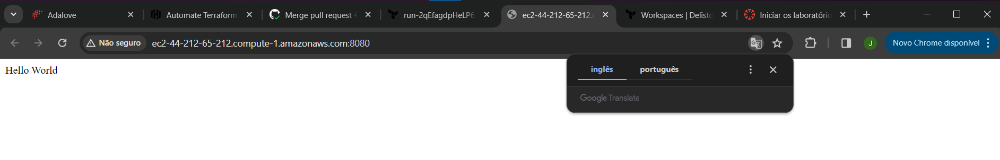

# Automate Terraform with GitHub Actions

O Terraform é uma ferramenta de Infraestrutura como Código (IaC) usada para construir, alterar e versionar a infraestrutura de forma eficiente. O GitHub Actions é uma plataforma CI/CD que automatiza seu pipeline de build, teste e implantação.

Usar o Terraform com o GitHub Actions permite a automação do gerenciamento de recursos na nuvem de maneira robusta, consistente e previsível. A combinação possibilita definir a infraestrutura em forma de código e automatizar sua implantação usando os workflows orientados por eventos do GitHub.

## Resumo do Processo

Saída do Plano do Terraform Cloud
Um pull request foi mesclado no GitHub, o que iniciou um Plano do Terraform Cloud. O plano indicou que 3 recursos seriam adicionados, sem alterações ou destruições.

Plano Especulativo do Terraform
O plano especulativo do Terraform Cloud indica os recursos que seriam criados. Isso foi acionado através da API do GitHub e oferece uma prévia das ações a serem tomadas sem aplicar mudanças.

Instância Web
Após a conclusão e mesclagem do pull request, uma instância EC2 foi provisionada como parte dos recursos. Acessando o IP público na porta especificada, viu-se uma implantação bem-sucedida com uma mensagem de "Hello World".

Detalhes da Instância EC2 da AWS
Os detalhes da instância EC2 criada podem ser vistos no Console de Gerenciamento da AWS, mostrando que a instância está ativa e em execução com um IP público atribuído.

## Conceitos Aprendidos
Infraestrutura como Código (IaC): Definição e gerenciamento de infraestrutura por meio de código, em vez de processos manuais.
GitHub Actions: Automação de workflows para executar scripts em eventos específicos do GitHub, como push ou pull requests.
Terraform Cloud: Um serviço em nuvem que ajuda na gestão de execuções do Terraform em um ambiente consistente e confiável, com gerenciamento compartilhado de estado e segredos.
Planos Especulativos: Funcionalidade do Terraform que gera um plano mostrando o que aconteceria se ele fosse aplicado, sem fazer nenhuma mudança real.
Gerenciamento e Bloqueio de Estado: Garantindo que o arquivo de estado do Terraform seja tratado de forma segura e consistente, prevenindo condições de corrida.

## Conclusão
O Terraform e o GitHub Actions juntos simplificam o processo de gerenciamento de infraestrutura, permitindo que os desenvolvedores gerenciem a infraestrutura com facilidade e confiança. Ao codificar recursos na nuvem, a equipe garante que as implantações de infraestrutura sejam repetíveis e menos propensas a erros humanos, levando a um ciclo de vida de infraestrutura mais confiável.